# 🚀 AgentFlow Infrastructure - Complete End-to-End Guide

## 📋 Table of Contents

1. [Overview & Architecture](#overview--architecture)
2. [Prerequisites](#prerequisites)
3. [Installation Methods](#installation-methods)
4. [Configuration](#configuration)
5. [Deployment Strategies](#deployment-strategies)
6. [Usage Guide](#usage-guide)
7. [Monitoring & Observability](#monitoring--observability)
8. [Examples & Use Cases](#examples--use-cases)
9. [Troubleshooting](#troubleshooting)
10. [Advanced Topics](#advanced-topics)

---

## 🏗️ Overview & Architecture

AgentFlow is a comprehensive agent orchestration platform built around five interconnected pillars:

### Core Components

- **🎯 AOR (Agent Orchestration Runtime)** - Fan-out/fan-in, retries, backpressure, cancellation, and idempotency for multi-agent DAGs
- **📝 POP (PromptOps Platform)** - Versioned, testable prompts with evaluation, canary rollouts, and composability
- **🔍 SCL (Secure Context Layer)** - Sanitize, validate, and authorize untrusted context
- **📊 AOS (Agent Observability Stack)** - Semantic traces, diffs, replay, and root-cause analysis
- **💰 CAS (Cost-Aware Scheduler)** - Keep LLM/API costs predictable while preserving quality/SLA

### Architecture Diagram

```mermaid
graph TB
    %% External Interfaces
    User[👤 Developer/User]
    CLI[🖥️ AgentCtl CLI]
    WebUI[🌐 Web Dashboard]
    SDK[📦 Go SDK]

    %% Core Services - The Five Pillars
    subgraph "🏗️ AgentFlow Infrastructure"
        subgraph "🎯 AOR - Agent Orchestration Runtime"
            CP[Control Plane]
            Scheduler[Scheduler]
            Worker[Worker Nodes]
            Monitor[Monitor]
        end

        subgraph "📝 POP - Prompt Operations Platform"
            PromptMgr[Prompt Manager]
            TemplateEngine[Template Engine]
            Evaluator[Evaluator]
            Deployer[Deployment Manager]
        end

        subgraph "💰 CAS - Cost & Allocation Service"
            Router[Provider Router]
            BudgetMgr[Budget Manager]
            QuotaMgr[Quota Manager]
            CacheMgr[Cache Manager]
            Optimizer[Cost Optimizer]
            Bandit[Multi-Armed Bandit]
        end

        subgraph "🔍 SCL - Security & Compliance Layer"
            Redactor[Data Redactor]
            Auditor[Audit Logger]
            Compliance[Compliance Engine]
        end

        subgraph "📊 AOS - Analytics & Observability Service"
            TraceCollector[Trace Collector]
            Analyzer[Trace Analyzer]
            Replayer[Replay Engine]
            Dashboard[Analytics Dashboard]
        end
    end

    %% External AI Providers
    subgraph "🤖 AI Providers"
        OpenAI[OpenAI GPT-4]
        Anthropic[Anthropic Claude]
        Google[Google Gemini]
        Cohere[Cohere]
        Custom[Custom Models]
    end

    %% Data Layer
    subgraph "💾 Data Layer"
        Postgres[(PostgreSQL)]
        Redis[(Redis Cache)]
        ClickHouse[(ClickHouse Analytics)]
        NATS[NATS Messaging]
    end

    %% User Interactions
    User --> CLI
    User --> WebUI
    User --> SDK

    %% CLI Operations
    CLI --> CP
    CLI --> PromptMgr
    CLI --> BudgetMgr
    CLI --> TraceCollector

    %% SDK Integration
    SDK --> CP
    SDK --> PromptMgr
    SDK --> CAS

    %% AOR Workflow
    CP --> Scheduler
    Scheduler --> Worker
    Worker --> Monitor
    Monitor --> CP

    %% POP Operations
    PromptMgr --> TemplateEngine
    TemplateEngine --> Evaluator
    Evaluator --> Deployer

    %% CAS Intelligence
    Router --> Bandit
    Bandit --> Router
    Router --> OpenAI
    Router --> Anthropic
    Router --> Google
    Router --> Cohere
    Router --> Custom

    BudgetMgr --> QuotaMgr
    QuotaMgr --> CacheMgr
    CacheMgr --> Optimizer

    %% Security Layer
    Redactor --> Auditor
    Auditor --> Compliance

    %% Analytics Flow
    TraceCollector --> Analyzer
    Analyzer --> Replayer
    Replayer --> Dashboard

    %% Data Connections
    CP --> Postgres
    CP --> Redis
    CP --> NATS

    PromptMgr --> Postgres
    BudgetMgr --> Postgres
    QuotaMgr --> Redis
    CacheMgr --> Redis

    TraceCollector --> ClickHouse
    Analyzer --> ClickHouse

    Worker --> NATS
    Monitor --> NATS

    %% Cross-Service Communication
    CP -.-> CAS
    Worker -.-> SCL
    Router -.-> AOS
    PromptMgr -.-> SCL
```



---

## 🔧 Prerequisites

### System Requirements

- **Operating System**: Linux, macOS, or Windows
- **Memory**: Minimum 8GB RAM (16GB+ recommended for production)
- **Storage**: 20GB+ free space
- **Network**: Internet access for AI provider APIs

### Required Software

#### For Development
- **Docker & Docker Compose**: Latest version
- **Go**: 1.21+ (for building from source)
- **Git**: For version control
- **Make**: For build automation

#### For Production
- **Kubernetes**: 1.24+ (for production deployment)
- **Helm**: 3.0+ (optional, for advanced deployments)
- **External Databases**: PostgreSQL 13+, Redis 6+, ClickHouse 23+

### AI Provider Accounts

You'll need API keys for at least one AI provider:
- **OpenAI**: API key from [platform.openai.com](https://platform.openai.com)
- **Anthropic**: API key from [console.anthropic.com](https://console.anthropic.com)
- **Google**: API key from [console.cloud.google.com](https://console.cloud.google.com)
- **Cohere**: API key from [dashboard.cohere.ai](https://dashboard.cohere.ai)

---

## 🚀 Installation Methods

### Method 1: Docker Compose (Recommended for Development)

#### Option A: Using Pre-built Packages (Fastest)
```bash
# Clone the repository
git clone https://github.com/Siddhant-K-code/agentflow-infrastructure.git
cd agentflow-infrastructure

# Use pre-built Docker images
docker-compose -f docker-compose.prod.yml up -d

# Verify services are running
docker-compose ps
```

#### Option B: Building from Source
```bash
# Clone the repository
git clone https://github.com/Siddhant-K-code/agentflow-infrastructure.git
cd agentflow-infrastructure

# Start all services (builds images locally)
make dev-up

# Verify services are running
make status
```

#### What This Does
- Starts PostgreSQL, Redis, ClickHouse, and NATS
- Uses pre-built Control Plane and Worker images from GitHub Container Registry
- Sets up Prometheus and Grafana for monitoring
- Creates all necessary database schemas

#### Access Points
- **Control Plane API**: http://localhost:8080
- **Grafana Dashboard**: http://localhost:3000 (admin/admin)
- **Prometheus**: http://localhost:9090

### Method 2: Kubernetes (Production)

#### Prerequisites
```bash
# Ensure you have a Kubernetes cluster
kubectl cluster-info

# Verify cluster access
kubectl get nodes
```

#### Deploy to Kubernetes
```bash
# Deploy all components (uses pre-built images)
make k8s-deploy

# Check deployment status
kubectl get pods -n agentflow
kubectl get services -n agentflow
```

#### Using Pre-built Images in Kubernetes
The Kubernetes manifests are configured to use the pre-built images from GitHub Container Registry:
- Control Plane: `ghcr.io/siddhant-k-code/agentflow-infrastructure/agentflow-control-plane:latest`
- Worker: `ghcr.io/siddhant-k-code/agentflow-infrastructure/agentflow-worker:latest`

To use a specific version, update the image tags in the Kubernetes manifests:
```bash
# Update to a specific version
kubectl set image deployment/control-plane control-plane=ghcr.io/siddhant-k-code/agentflow-infrastructure/agentflow-control-plane:v1.0.0 -n agentflow
kubectl set image deployment/workers worker=ghcr.io/siddhant-k-code/agentflow-infrastructure/agentflow-worker:v1.0.0 -n agentflow
```

#### Access Services
```bash
# Port forward to access services locally
kubectl port-forward -n agentflow svc/control-plane 8080:8080
kubectl port-forward -n agentflow svc/grafana 3000:3000
```

### Method 3: Local Development

#### Build from Source
```bash
# Install dependencies
make dev-deps

# Build all binaries
make build

# Run database migrations
make migrate-up

# Start services individually
make run-control-plane  # In terminal 1
make run-worker         # In terminal 2
```

#### Install CLI
```bash
# Install agentctl globally
make install-cli

# Verify installation
agentctl --version
```

### Method 4: Using Pre-built Docker Packages

AgentFlow provides pre-built Docker images on GitHub Container Registry for faster deployment:

#### Available Packages
- **Control Plane**: `ghcr.io/siddhant-k-code/agentflow-infrastructure/agentflow-control-plane:latest`
- **Worker**: `ghcr.io/siddhant-k-code/agentflow-infrastructure/agentflow-worker:latest`

#### Quick Start with Pre-built Images
```bash
# Pull the latest images
docker pull ghcr.io/siddhant-k-code/agentflow-infrastructure/agentflow-control-plane:latest
docker pull ghcr.io/siddhant-k-code/agentflow-infrastructure/agentflow-worker:latest

# Run with Docker Compose (uses pre-built images)
docker-compose -f docker-compose.prod.yml up -d
```

> **Note**: The `docker-compose.prod.yml` file is already configured to use the pre-built images from GitHub Container Registry. This is the recommended way to run AgentFlow with pre-built packages.

#### Manual Container Deployment
```bash
# Start supporting services first
docker-compose up -d postgres redis clickhouse nats

# Run Control Plane
docker run -d \
  --name agentflow-control-plane \
  --network agentflow_default \
  -p 8080:8080 \
  -e DB_HOST=postgres \
  -e DB_USER=agentflow \
  -e DB_PASSWORD=agentflow_password \
  -e DB_NAME=agentflow \
  -e REDIS_HOST=redis \
  -e REDIS_PASSWORD=agentflow_password \
  -e CLICKHOUSE_HOST=clickhouse \
  -e CLICKHOUSE_USER=agentflow \
  -e CLICKHOUSE_PASSWORD=agentflow_password \
  -e CLICKHOUSE_DATABASE=agentflow \
  -e NATS_URL=nats://nats:4222 \
  ghcr.io/siddhant-k-code/agentflow-infrastructure/agentflow-control-plane:latest

# Run Worker
docker run -d \
  --name agentflow-worker \
  --network agentflow_default \
  -e DB_HOST=postgres \
  -e DB_USER=agentflow \
  -e DB_PASSWORD=agentflow_password \
  -e DB_NAME=agentflow \
  -e REDIS_HOST=redis \
  -e REDIS_PASSWORD=agentflow_password \
  -e CLICKHOUSE_HOST=clickhouse \
  -e CLICKHOUSE_USER=agentflow \
  -e CLICKHOUSE_PASSWORD=agentflow_password \
  -e CLICKHOUSE_DATABASE=agentflow \
  -e NATS_URL=nats://nats:4222 \
  -e WORKER_ID=worker-1 \
  ghcr.io/siddhant-k-code/agentflow-infrastructure/agentflow-worker:latest
```

#### Benefits of Pre-built Packages
- **Faster Deployment**: No need to build images locally
- **Consistent Environment**: Same images used across different environments
- **Reduced Resource Usage**: No build time or local dependencies
- **Easy Updates**: Simply pull the latest tag
- **Production Ready**: Images are built with production optimizations

#### Version Management
```bash
# Check available versions
docker images | grep agentflow

# Pull a specific version
docker pull ghcr.io/siddhant-k-code/agentflow-infrastructure/agentflow-control-plane:v1.0.0
docker pull ghcr.io/siddhant-k-code/agentflow-infrastructure/agentflow-worker:v1.0.0

# Update to latest version
docker-compose -f docker-compose.prod.yml pull
docker-compose -f docker-compose.prod.yml up -d

# Pin to specific version in docker-compose.prod.yml
# Change image tags from :latest to :v1.0.0
```

#### Package Information
- **Registry**: GitHub Container Registry (ghcr.io)
- **Organization**: siddhant-k-code
- **Repository**: agentflow-infrastructure
- **Available Tags**: latest, main, and version-specific tags
- **Architecture**: Multi-arch (linux/amd64, linux/arm64)

---

## ⚙️ Configuration

### Environment Variables

Create a `.env` file or set these environment variables:

```bash
# Database Configuration
DB_HOST=localhost
DB_PORT=5432
DB_USER=agentflow
DB_PASSWORD=your_secure_password
DB_NAME=agentflow
DB_SSL_MODE=disable

# Redis Configuration
REDIS_HOST=localhost
REDIS_PORT=6379
REDIS_PASSWORD=your_redis_password

# ClickHouse Configuration
CLICKHOUSE_HOST=localhost
CLICKHOUSE_PORT=9000
CLICKHOUSE_USER=agentflow
CLICKHOUSE_PASSWORD=your_clickhouse_password
CLICKHOUSE_DATABASE=agentflow

# NATS Configuration
NATS_URL=nats://localhost:4222

# API Configuration
API_PORT=8080
API_HOST=0.0.0.0

# Organization & Security
DEFAULT_ORG_ID=your-org-uuid
API_KEY=your-secure-api-key

# AI Provider API Keys
OPENAI_API_KEY=your-openai-key
ANTHROPIC_API_KEY=your-anthropic-key
GOOGLE_API_KEY=your-google-key
COHERE_API_KEY=your-cohere-key
```

### Configuration Files

#### Control Plane Configuration (`config/control-plane.yaml`)
```yaml
server:
  host: "0.0.0.0"
  port: 8080

database:
  host: "${DB_HOST}"
  port: ${DB_PORT}
  user: "${DB_USER}"
  password: "${DB_PASSWORD}"
  database: "${DB_NAME}"
  ssl_mode: "${DB_SSL_MODE}"

redis:
  host: "${REDIS_HOST}"
  port: ${REDIS_PORT}
  password: "${REDIS_PASSWORD}"

clickhouse:
  host: "${CLICKHOUSE_HOST}"
  port: ${CLICKHOUSE_PORT}
  user: "${CLICKHOUSE_USER}"
  password: "${CLICKHOUSE_PASSWORD}"
  database: "${CLICKHOUSE_DATABASE}"

nats:
  url: "${NATS_URL}"

auth:
  api_keys:
    - key: "your-secure-api-key"
      org_id: "your-org-uuid"
      permissions: ["read", "write", "admin"]

logging:
  level: "info"
  format: "json"
```

#### Worker Configuration (`config/worker.yaml`)
```yaml
worker:
  id: "${WORKER_ID:-worker-1}"
  concurrency: 10

database:
  host: "${DB_HOST}"
  port: ${DB_PORT}
  user: "${DB_USER}"
  password: "${DB_PASSWORD}"
  database: "${DB_NAME}"

redis:
  host: "${REDIS_HOST}"
  port: ${REDIS_PORT}
  password: "${REDIS_PASSWORD}"

nats:
  url: "${NATS_URL}"

logging:
  level: "info"
  format: "json"
```

---

## 🚀 Deployment Strategies

### Development Deployment

#### Using Docker Compose
```bash
# Start development environment
make dev-up

# View logs
make logs

# Stop environment
make dev-down
```

#### Using Pre-built Images
```bash
# Use production images
docker-compose -f docker-compose.prod.yml up -d
```

### Production Deployment

#### Kubernetes with Helm (Recommended)

1. **Create Helm Chart**:
```bash
# Generate Helm chart
helm create agentflow

# Customize values.yaml
cat > agentflow/values.yaml << EOF
controlPlane:
  replicas: 3
  resources:
    requests:
      memory: "512Mi"
      cpu: "250m"
    limits:
      memory: "1Gi"
      cpu: "500m"

worker:
  replicas: 5
  resources:
    requests:
      memory: "256Mi"
      cpu: "100m"
    limits:
      memory: "512Mi"
      cpu: "250m"

database:
  host: "postgres-service"
  password: "secure-password"

redis:
  host: "redis-service"
  password: "secure-password"
EOF
```

2. **Deploy with Helm**:
```bash
# Install chart
helm install agentflow ./agentflow

# Upgrade deployment
helm upgrade agentflow ./agentflow

# Check status
helm status agentflow
```

#### Manual Kubernetes Deployment

```bash
# Create namespace
kubectl create namespace agentflow

# Apply configurations in order
kubectl apply -f k8s/namespace.yaml
kubectl apply -f k8s/postgres.yaml
kubectl apply -f k8s/clickhouse.yaml
kubectl apply -f k8s/redis.yaml
kubectl apply -f k8s/nats.yaml
kubectl apply -f k8s/control-plane.yaml
kubectl apply -f k8s/workers.yaml

# Wait for deployments
kubectl wait --for=condition=available --timeout=300s deployment/control-plane -n agentflow
kubectl wait --for=condition=available --timeout=300s deployment/workers -n agentflow
```

### High Availability Setup

#### Multi-Region Deployment
```yaml
# k8s/control-plane-ha.yaml
apiVersion: apps/v1
kind: Deployment
metadata:
  name: control-plane
spec:
  replicas: 3
  strategy:
    type: RollingUpdate
    rollingUpdate:
      maxSurge: 1
      maxUnavailable: 0
  template:
    spec:
      affinity:
        podAntiAffinity:
          preferredDuringSchedulingIgnoredDuringExecution:
          - weight: 100
            podAffinityTerm:
              labelSelector:
                matchExpressions:
                - key: app
                  operator: In
                  values:
                  - control-plane
              topologyKey: kubernetes.io/hostname
```

#### Database High Availability
- Use managed PostgreSQL (AWS RDS, Google Cloud SQL, Azure Database)
- Configure Redis Cluster for caching
- Set up ClickHouse cluster for analytics

---

## 📖 Usage Guide

### CLI Setup and Configuration

#### Install and Configure CLI
```bash
# Install agentctl
make install-cli

# Configure API endpoint
agentctl config set endpoint https://your-agentflow-api.com

# Set organization ID
agentctl config set org-id your-organization-id

# Set API key
agentctl config set token your-api-key

# Verify configuration
agentctl status
```

#### CLI Commands Overview

```bash
# Workflow Management
agentctl workflow submit <workflow-name> --inputs '{"key": "value"}'
agentctl workflow list --status running
agentctl workflow get <workflow-id>
agentctl workflow cancel <workflow-id>

# Prompt Management
agentctl prompt create <name> --template "Your template here"
agentctl prompt list
agentctl prompt get <name> <version>
agentctl prompt eval <name> <version>
agentctl prompt deploy <name>

# Trace and Monitoring
agentctl trace get <trace-id>
agentctl trace query --start 1h --end now
agentctl trace replay <trace-id>
agentctl trace diff <trace-id-1> <trace-id-2>

# Budget Management
agentctl budget create --limit 1000 --period monthly
agentctl budget list
agentctl budget get <budget-id>

# System Status
agentctl status
agentctl config show
```

### Go SDK Usage

#### Basic Setup
```go
package main

import (
    "context"
    "fmt"
    "log"

    "github.com/Siddhant-K-code/agentflow-infrastructure/sdk/go/agentflow"
)

func main() {
    // Create client
    client := agentflow.NewClient(agentflow.ClientOptions{
        BaseURL: "http://localhost:8080",
        Token:   "your-api-key",
        OrgID:   "your-org-id",
    })

    // Use the client...
}
```

#### Creating and Submitting Workflows

```go
// Create a workflow using the builder
workflow := agentflow.NewWorkflow("document_analysis").
    Version(1).
    Tool("ingest", "s3.fetch", map[string]interface{}{
        "bucket": "documents",
        "key":    "{{document_key}}",
    }).
    LLM("analyze", "document_analyzer@3").
    WithQuality("Gold").
    WithSLA(30*time.Second).
    WithInputs(map[string]string{
        "content": "ingest.output",
    }).
    DependsOn("ingest").
    End()

// Submit workflow
ctx := context.Background()
run, err := client.Workflows().Submit(ctx, &agentflow.SubmitWorkflowRequest{
    WorkflowName: "document_analysis",
    Inputs: map[string]interface{}{
        "document_key": "sample.pdf",
    },
    BudgetCents: 1000,
})

if err != nil {
    log.Fatal(err)
}

fmt.Printf("Workflow submitted: %s\n", run.ID)
```

#### Managing Prompts

```go
// Create a prompt template
prompt, err := client.Prompts().Create(ctx, &agentflow.CreatePromptRequest{
    Name: "document_analyzer",
    Template: "Analyze this document: {{.content}}",
    Schema: map[string]interface{}{
        "content": map[string]interface{}{
            "type": "string",
            "required": true,
        },
    },
})

if err != nil {
    log.Fatal(err)
}

fmt.Printf("Prompt created: %s\n", prompt.ID)
```

#### Monitoring Workflows

```go
// Get workflow status
run, err := client.Workflows().Get(ctx, runID)
if err != nil {
    log.Fatal(err)
}

fmt.Printf("Status: %s\n", run.Status)
fmt.Printf("Cost: %d cents\n", run.CostCents)

// Get traces
traces, err := client.Traces().Query(ctx, &agentflow.TraceQueryOptions{
    WorkflowRunID: runID,
    Limit:         100,
})

if err != nil {
    log.Fatal(err)
}

for _, trace := range traces.Events {
    fmt.Printf("Event: %s at %s\n", trace.Type, trace.Timestamp)
}
```

### Workflow Definition Examples

#### Simple Document Analysis
```yaml
name: document_analysis
version: 1
dag:
  nodes:
    - id: ingest
      type: tool
      config:
        tool_name: s3.fetch
        tool_args:
          bucket: documents
          key: "{{document_key}}"
    - id: analyze
      type: llm
      config:
        prompt_ref: document_analyzer@3
        inputs:
          content: "ingest.output"
      policy:
        quality: Gold
        sla_ms: 30000
  edges:
    - from: ingest
      to: analyze
```

#### Map-Reduce Pattern
```yaml
name: map_reduce_analysis
version: 1
dag:
  nodes:
    - id: split
      type: function
      config:
        function_name: text_splitter
        function_args:
          chunk_size: 1000
    - id: map_analyze
      type: llm
      config:
        prompt_ref: chunk_analyzer@2
        parallel: true
    - id: reduce_summarize
      type: llm
      config:
        prompt_ref: summarizer@1
        inputs:
          chunks: "map_analyze.output"
  edges:
    - from: split
      to: map_analyze
    - from: map_analyze
      to: reduce_summarize
```

#### Conditional Workflow
```yaml
name: conditional_processing
version: 1
dag:
  nodes:
    - id: classify
      type: llm
      config:
        prompt_ref: document_classifier@1
    - id: process_text
      type: llm
      config:
        prompt_ref: text_processor@2
        condition: "classify.output.type == 'text'"
    - id: process_image
      type: tool
      config:
        tool_name: image_analyzer
        condition: "classify.output.type == 'image'"
    - id: merge
      type: function
      config:
        function_name: result_merger
  edges:
    - from: classify
      to: process_text
    - from: classify
      to: process_image
    - from: process_text
      to: merge
    - from: process_image
      to: merge
```

---

## 📊 Monitoring & Observability

### Built-in Monitoring

#### Health Checks
```bash
# Check service health
curl http://localhost:8080/health

# Check readiness
curl http://localhost:8080/ready

# Get metrics
curl http://localhost:8080/metrics
```

#### Grafana Dashboards

Access Grafana at http://localhost:3000 (admin/admin) for:

- **Workflow Performance**: Success rates, latency, throughput
- **Cost Analysis**: Spending by provider, model, and organization
- **Resource Utilization**: CPU, memory, and network usage
- **Error Analysis**: Failed workflows and error patterns

#### Key Metrics

| Metric | Description | Type |
|--------|-------------|------|
| `workflow_runs_total` | Total workflow runs | Counter |
| `workflow_duration_seconds` | Workflow execution time | Histogram |
| `workflow_cost_cents` | Cost per workflow | Histogram |
| `step_retries_total` | Total step retries | Counter |
| `cache_hits_total` | Cache hit rate | Counter |
| `provider_requests_total` | API requests by provider | Counter |

### Custom Monitoring

#### Adding Custom Metrics
```go
// In your workflow step
import "github.com/prometheus/client_golang/prometheus"

var customCounter = prometheus.NewCounterVec(
    prometheus.CounterOpts{
        Name: "custom_operations_total",
        Help: "Total custom operations",
    },
    []string{"operation_type", "status"},
)

// Increment counter
customCounter.WithLabelValues("data_processing", "success").Inc()
```

#### Alerting Rules
```yaml
# monitoring/alerts.yaml
groups:
- name: agentflow
  rules:
  - alert: HighErrorRate
    expr: rate(workflow_runs_total{status="failed"}[5m]) > 0.1
    for: 2m
    labels:
      severity: warning
    annotations:
      summary: "High error rate detected"

  - alert: HighCost
    expr: increase(workflow_cost_cents[1h]) > 10000
    for: 5m
    labels:
      severity: critical
    annotations:
      summary: "High cost detected"
```

### Trace Analysis

#### Using the CLI
```bash
# Get detailed trace
agentctl trace get <trace-id> --output timeline

# Query traces with filters
agentctl trace query --start 1h --end now --provider openai

# Compare traces
agentctl trace diff <trace-id-1> <trace-id-2> --costs --latency

# Replay trace
agentctl trace replay <trace-id> --mode shadow
```

#### Programmatic Trace Analysis
```go
// Get trace details
trace, err := client.Traces().Get(ctx, traceID)
if err != nil {
    log.Fatal(err)
}

// Analyze performance
for _, event := range trace.Events {
    if event.Type == "llm_call" {
        fmt.Printf("LLM Call: %s (%.2fs, %d tokens)\n",
            event.Provider,
            event.Duration.Seconds(),
            event.Tokens)
    }
}
```

---

## 💡 Examples & Use Cases

### Example 1: Content Moderation Pipeline

```go
// Create content moderation workflow
workflow := agentflow.NewWorkflow("content_moderation").
    Version(1).

    // Ingest content
    Tool("ingest", "s3.fetch", map[string]interface{}{
        "bucket": "user-content",
        "key":    "{{content_id}}",
    }).

    // Classify content type
    LLM("classify", "content_classifier@2").
    WithInputs(map[string]string{
        "content": "ingest.output",
    }).
    DependsOn("ingest").

    // Moderate based on type
    LLM("moderate", "moderation_engine@1").
    WithInputs(map[string]string{
        "content": "ingest.output",
        "type":    "classify.output.type",
    }).
    WithQuality("Gold").
    DependsOn("classify").

    // Store results
    Tool("store", "s3.put", map[string]interface{}{
        "bucket": "moderation-results",
        "key":    "{{content_id}}/result.json",
        "body":   "moderate.output",
    }).
    DependsOn("moderate").

    End()

// Submit for processing
run, err := client.Workflows().Submit(ctx, &agentflow.SubmitWorkflowRequest{
    WorkflowName: "content_moderation",
    Inputs: map[string]interface{}{
        "content_id": "user-upload-123",
    },
})
```

### Example 2: Multi-Language Translation

```go
// Create translation workflow
workflow := agentflow.NewWorkflow("multi_lang_translation").
    Version(1).

    // Detect language
    LLM("detect_lang", "language_detector@1").
    WithInputs(map[string]string{
        "text": "{{input_text}}",
    }).

    // Translate to multiple languages
    LLM("translate_en", "translator@2").
    WithInputs(map[string]string{
        "text": "{{input_text}}",
        "target": "en",
    }).
    WithCondition("detect_lang.output.language != 'en'").
    DependsOn("detect_lang").

    LLM("translate_es", "translator@2").
    WithInputs(map[string]string{
        "text": "{{input_text}}",
        "target": "es",
    }).
    DependsOn("detect_lang").

    LLM("translate_fr", "translator@2").
    WithInputs(map[string]string{
        "text": "{{input_text}}",
        "target": "fr",
    }).
    DependsOn("detect_lang").

    // Combine results
    Function("combine", "result_combiner", map[string]interface{}{
        "format": "json",
    }).
    WithInputs(map[string]string{
        "original": "{{input_text}}",
        "english":  "translate_en.output",
        "spanish":  "translate_es.output",
        "french":   "translate_fr.output",
    }).
    DependsOn("translate_en", "translate_es", "translate_fr").

    End()
```

### Example 3: Cost-Optimized Data Processing

```go
// Create cost-optimized workflow
workflow := agentflow.NewWorkflow("cost_optimized_processing").
    Version(1).

    // Pre-process with cheaper model
    LLM("preprocess", "text_processor@1").
    WithQuality("Bronze").
    WithInputs(map[string]string{
        "text": "{{input_text}}",
    }).

    // Route based on complexity
    Function("route", "complexity_router", map[string]interface{}{
        "threshold": 0.8,
    }).
    WithInputs(map[string]string{
        "text": "preprocess.output",
    }).
    DependsOn("preprocess").

    // Simple processing for low complexity
    LLM("simple_analyze", "simple_analyzer@1").
    WithQuality("Bronze").
    WithInputs(map[string]string{
        "text": "preprocess.output",
    }).
    WithCondition("route.output.complexity < 0.8").
    DependsOn("route").

    // Complex processing for high complexity
    LLM("complex_analyze", "advanced_analyzer@3").
    WithQuality("Gold").
    WithInputs(map[string]string{
        "text": "preprocess.output",
    }).
    WithCondition("route.output.complexity >= 0.8").
    DependsOn("route").

    // Merge results
    Function("merge", "result_merger", map[string]interface{}{
        "strategy": "priority",
    }).
    WithInputs(map[string]string{
        "simple": "simple_analyze.output",
        "complex": "complex_analyze.output",
        "routing": "route.output",
    }).
    DependsOn("simple_analyze", "complex_analyze").

    End()
```

---

## 🔧 Troubleshooting

### Common Issues

#### 1. Service Connection Errors

**Problem**: Cannot connect to services
```bash
# Check service status
docker-compose ps

# Check logs
docker-compose logs control-plane
docker-compose logs worker

# Test connectivity
curl http://localhost:8080/health
```

**Solution**:
- Verify all services are running
- Check network connectivity
- Verify port configurations

#### 2. Database Connection Issues

**Problem**: Database connection failures
```bash
# Check PostgreSQL
docker-compose exec postgres psql -U agentflow -d agentflow -c "SELECT 1;"

# Check Redis
docker-compose exec redis redis-cli ping

# Check ClickHouse
curl http://localhost:8123/ping
```

**Solution**:
- Verify database credentials
- Check database service health
- Run migrations: `make migrate-up`

#### 3. Workflow Execution Failures

**Problem**: Workflows failing to execute
```bash
# Check workflow status
agentctl workflow get <workflow-id>

# Check traces
agentctl trace get <trace-id>

# Check worker logs
docker-compose logs worker
```

**Solution**:
- Verify AI provider API keys
- Check workflow definition syntax
- Review error messages in traces

#### 4. High Memory Usage

**Problem**: Services consuming too much memory
```bash
# Check resource usage
docker stats

# Check Kubernetes resources
kubectl top pods -n agentflow
```

**Solution**:
- Adjust worker concurrency settings
- Increase memory limits
- Optimize workflow definitions

### Debug Commands

```bash
# System status
agentctl status --verbose

# Service health
curl -H "Authorization: Bearer $API_KEY" $API_ENDPOINT/health

# Database status
make migrate-up

# Reset development environment
make dev-down
make dev-up

# View all logs
make logs

# Backup data
make backup
```

### Performance Optimization

#### 1. Worker Scaling
```yaml
# Increase worker concurrency
worker:
  concurrency: 20  # Default: 10
```

#### 2. Caching Configuration
```yaml
# Enable aggressive caching
cache:
  enabled: true
  ttl: 3600  # 1 hour
  max_size: "1GB"
```

#### 3. Database Optimization
```sql
-- Add indexes for better performance
CREATE INDEX CONCURRENTLY idx_workflow_run_created_at_status
ON workflow_run(created_at, status);

CREATE INDEX CONCURRENTLY idx_step_run_workflow_status
ON step_run(workflow_run_id, status);
```

---

## 🚀 Advanced Topics

### Custom Providers

#### Adding a Custom AI Provider
```go
// internal/providers/custom.go
type CustomProvider struct {
    apiKey string
    baseURL string
}

func (p *CustomProvider) Generate(ctx context.Context, req *GenerateRequest) (*GenerateResponse, error) {
    // Implement custom provider logic
    return &GenerateResponse{
        Text: "Generated response",
        Tokens: 100,
        CostCents: 50,
    }, nil
}

// Register provider
func init() {
    RegisterProvider("custom", func(config map[string]interface{}) (Provider, error) {
        return &CustomProvider{
            apiKey: config["api_key"].(string),
            baseURL: config["base_url"].(string),
        }, nil
    })
}
```

### Custom Tools

#### Creating Custom Tools
```go
// internal/tools/custom.go
type CustomTool struct {
    name string
    config map[string]interface{}
}

func (t *CustomTool) Execute(ctx context.Context, inputs map[string]interface{}) (map[string]interface{}, error) {
    // Implement tool logic
    return map[string]interface{}{
        "result": "Tool execution completed",
    }, nil
}

// Register tool
func init() {
    RegisterTool("custom_tool", func(config map[string]interface{}) (Tool, error) {
        return &CustomTool{
            name: "custom_tool",
            config: config,
        }, nil
    })
}
```

### Security Hardening

#### API Key Management
```yaml
# Use Kubernetes secrets
apiVersion: v1
kind: Secret
metadata:
  name: agentflow-secrets
type: Opaque
data:
  api-key: <base64-encoded-key>
  db-password: <base64-encoded-password>
```

#### Network Policies
```yaml
# Restrict network access
apiVersion: networking.k8s.io/v1
kind: NetworkPolicy
metadata:
  name: agentflow-netpol
spec:
  podSelector:
    matchLabels:
      app: agentflow
  policyTypes:
  - Ingress
  - Egress
  ingress:
  - from:
    - namespaceSelector:
        matchLabels:
          name: agentflow
```

### Multi-Tenancy

#### Organization Isolation
```go
// Ensure data isolation
func (s *WorkflowService) Submit(ctx context.Context, req *SubmitWorkflowRequest) (*WorkflowRun, error) {
    // Get organization from context
    orgID := getOrgIDFromContext(ctx)

    // Validate organization access
    if !s.hasAccess(orgID, req.WorkflowName) {
        return nil, errors.New("access denied")
    }

    // Create workflow run with organization
    run := &WorkflowRun{
        OrgID: orgID,
        // ... other fields
    }

    return s.createWorkflowRun(ctx, run)
}
```
