# AgentFlow

> [!WARNING]
> 🚧 **WORK IN PROGRESS - NOT PRODUCTION READY**
> 
> This project is currently under active development and is **NOT ready for production use**. The codebase is experimental and may contain incomplete features, breaking changes, and stability issues. Use at your own risk for development and testing purposes only.
> 
> **Do not deploy this in production environments.**

A comprehensive agent orchestration platform with five interconnected pillars: Agent Orchestration Runtime (AOR), PromptOps Platform (POP), Secure Context Layer (SCL), Agent Observability Stack (AOS), and Cost-Aware Scheduler (CAS).

## Architecture overview

AgentFlow provides a complete infrastructure for building, deploying, and managing AI agent workflows at scale. The platform is designed with five core pillars:

### 1. Agent Orchestration Runtime (AOR)
- **Purpose**: Fan-out/fan-in, retries, backpressure, cancellation, and idempotency for multi-agent DAGs
- **Features**:
  - DAG-based workflow execution
  - Map-reduce patterns
  - Exactly-once semantics
  - Deterministic replay
  - WASI sandbox execution

### 2. PromptOps Platform (POP)
- **Purpose**: Versioned, testable prompts with evaluation, canary rollouts, and composability
- **Features**:
  - Template versioning and composition
  - Automated evaluation suites
  - Canary deployments with traffic splitting
  - Git-friendly workflow

### 3. Secure Context Layer (SCL)
- **Purpose**: Sanitize, validate, and authorize untrusted context
- **Features**:
  - Schema validation and content filtering
  - PII redaction with reversible tokenization
  - Prompt injection detection
  - Policy-based access control

### 4. Agent Observability Stack (AOS)
- **Purpose**: Semantic traces, diffs, replay, and root-cause analysis
- **Features**:
  - Distributed tracing with semantic context
  - Workflow replay and comparison
  - Cost and performance analytics
  - Quality drift detection

### 5. Cost-Aware Scheduler (CAS)
- **Purpose**: Keep LLM/API costs predictable while preserving quality/SLA
- **Features**:
  - Multi-armed bandit provider routing
  - Budget enforcement and quotas
  - Intelligent caching and batching
  - Cost optimization recommendations

```mermaid
graph TB
    %% External Interfaces
    User[👤 Developer/User]
    CLI[🖥️ AgentCtl CLI]
    WebUI[🌐 Web Dashboard]
    SDK[📦 Go SDK]

    %% Core Services - The Five Pillars
    subgraph "🏗️ AgentFlow Infrastructure"
        subgraph "🎯 AOR - Agent Orchestration Runtime"
            CP[Control Plane]
            Scheduler[Scheduler]
            Worker[Worker Nodes]
            Monitor[Monitor]
        end

        subgraph "📝 POP - Prompt Operations Platform"
            PromptMgr[Prompt Manager]
            TemplateEngine[Template Engine]
            Evaluator[Evaluator]
            Deployer[Deployment Manager]
        end

        subgraph "💰 CAS - Cost & Allocation Service"
            Router[Provider Router]
            BudgetMgr[Budget Manager]
            QuotaMgr[Quota Manager]
            CacheMgr[Cache Manager]
            Optimizer[Cost Optimizer]
            Bandit[Multi-Armed Bandit]
        end

        subgraph "🔍 SCL - Security & Compliance Layer"
            Redactor[Data Redactor]
            Auditor[Audit Logger]
            Compliance[Compliance Engine]
        end

        subgraph "📊 AOS - Analytics & Observability Service"
            TraceCollector[Trace Collector]
            Analyzer[Trace Analyzer]
            Replayer[Replay Engine]
            Dashboard[Analytics Dashboard]
        end
    end

    %% External AI Providers
    subgraph "🤖 AI Providers"
        OpenAI[OpenAI GPT-4]
        Anthropic[Anthropic Claude]
        Google[Google Gemini]
        Cohere[Cohere]
        Custom[Custom Models]
    end

    %% Data Layer
    subgraph "💾 Data Layer"
        Postgres[(PostgreSQL)]
        Redis[(Redis Cache)]
        ClickHouse[(ClickHouse Analytics)]
        NATS[NATS Messaging]
    end

    %% User Interactions
    User --> CLI
    User --> WebUI
    User --> SDK

    %% CLI Operations
    CLI --> CP
    CLI --> PromptMgr
    CLI --> BudgetMgr
    CLI --> TraceCollector

    %% SDK Integration
    SDK --> CP
    SDK --> PromptMgr
    SDK --> CAS

    %% AOR Workflow
    CP --> Scheduler
    Scheduler --> Worker
    Worker --> Monitor
    Monitor --> CP

    %% POP Operations
    PromptMgr --> TemplateEngine
    TemplateEngine --> Evaluator
    Evaluator --> Deployer

    %% CAS Intelligence
    Router --> Bandit
    Bandit --> Router
    Router --> OpenAI
    Router --> Anthropic
    Router --> Google
    Router --> Cohere
    Router --> Custom

    BudgetMgr --> QuotaMgr
    QuotaMgr --> CacheMgr
    CacheMgr --> Optimizer

    %% Security Layer
    Redactor --> Auditor
    Auditor --> Compliance

    %% Analytics Flow
    TraceCollector --> Analyzer
    Analyzer --> Replayer
    Replayer --> Dashboard

    %% Data Connections
    CP --> Postgres
    CP --> Redis
    CP --> NATS

    PromptMgr --> Postgres
    BudgetMgr --> Postgres
    QuotaMgr --> Redis
    CacheMgr --> Redis

    TraceCollector --> ClickHouse
    Analyzer --> ClickHouse

    Worker --> NATS
    Monitor --> NATS

    %% Cross-Service Communication
    CP -.-> CAS
    Worker -.-> SCL
    Router -.-> AOS
    PromptMgr -.-> SCL

    %% Styling
    classDef userInterface fill:#4A90E2,stroke:#000000,stroke-width:2px,color:#FFFFFF
    classDef coreService fill:#7ED321,stroke:#000000,stroke-width:2px,color:#000000
    classDef aiProvider fill:#F5A623,stroke:#000000,stroke-width:2px,color:#000000
    classDef dataStore fill:#50E3C2,stroke:#000000,stroke-width:2px,color:#000000
    classDef security fill:#D0021B,stroke:#000000,stroke-width:2px,color:#FFFFFF
    classDef analytics fill:#9013FE,stroke:#000000,stroke-width:2px,color:#FFFFFF

    class User,CLI,WebUI,SDK userInterface
    class CP,Scheduler,Worker,Monitor,PromptMgr,TemplateEngine,Router,BudgetMgr coreService
    class OpenAI,Anthropic,Google,Cohere,Custom aiProvider
    class Postgres,Redis,ClickHouse,NATS dataStore
    class Redactor,Auditor,Compliance security
```




## Quick start

### Prerequisites

- Docker and Docker Compose
- Go 1.21+ (for development)
- Kubernetes cluster (for production deployment)

### Development Environment

1. **Clone the repository**:
   ```bash
   git clone https://github.com/Siddhant-K-code/agentflow-infrastructure.git
   cd agentflow-infrastructure
   ```

2. **Start the development environment**:
   ```bash
   make dev-up
   ```

3. **Install the CLI**:
   ```bash
   make build
   make install-cli
   ```

### Using Pre-built Container Images

AgentFlow publishes container images to GitHub Container Registry:

- **Control Plane**: `ghcr.io/siddhant-k-code/agentflow-infrastructure/agentflow-control-plane:latest`
- **Worker**: `ghcr.io/siddhant-k-code/agentflow-infrastructure/agentflow-worker:latest`

**Run with pre-built images**:
```bash
docker-compose -f docker-compose.prod.yml up -d
```

4. **Configure the CLI**:
   ```bash
   agentctl config init
   agentctl config login
   ```

### Your First Workflow

1. **Create a simple workflow**:
   ```bash
   cat > example-workflow.yaml << EOF
   name: document_analysis
   version: 1
   nodes:
     - id: ingest
       type: tool
       config:
         tool_name: s3.fetch
         tool_args:
           bucket: documents
           key: "{{document_key}}"
     - id: analyze
       type: llm
       config:
         prompt_ref: document_analyzer@3
         inputs:
           content: "ingest.output"
       policy:
         quality: Gold
         sla_ms: 30000
   edges:
     - from: ingest
       to: analyze
   EOF
   ```

2. **Submit the workflow**:
   ```bash
   agentctl workflow submit document_analysis \
     --inputs '{"document_key": "sample.pdf"}' \
     --budget 1000 \
     --wait
   ```

3. **Monitor execution**:
   ```bash
   agentctl workflow status <run-id>
   agentctl trace get <run-id>
   ```

## 📊 Monitoring and Observability

The platform includes comprehensive monitoring:

- **Grafana Dashboard**: http://localhost:3000 (admin/admin)
- **Prometheus Metrics**: http://localhost:9090
- **Control Plane API**: http://localhost:8080

### Key Metrics

- Workflow success rates and latency
- Cost breakdown by provider/model
- Cache hit rates and optimization opportunities
- Resource utilization and scaling metrics

## Development

### Project Structure

```
├── cmd/                    # Application entrypoints
│   ├── agentctl/          # CLI application
│   ├── control-plane/     # Control plane service
│   └── worker/            # Worker service
├── internal/              # Internal packages
│   ├── aor/              # Agent Orchestration Runtime
│   ├── pop/              # PromptOps Platform
│   ├── scl/              # Secure Context Layer
│   ├── aos/              # Agent Observability Stack
│   ├── cas/              # Cost-Aware Scheduler
│   ├── cli/              # CLI implementation
│   ├── config/           # Configuration management
│   └── db/               # Database abstractions
├── sdk/                   # Client SDKs
│   └── go/               # Go SDK
├── k8s/                  # Kubernetes manifests
├── monitoring/           # Monitoring configurations
├── migrations/           # Database migrations
└── docs/                 # Documentation
```

### Building and Testing

```bash
# Build all components
make build

# Run tests
make test

# Run linters
make lint

# Format code
make fmt
```

### Database Migrations

```bash
# Run migrations
make migrate-up

# Create new migration
make migrate-create

# Rollback migration
make migrate-down
```

## Configuration

### Environment Variables

| Variable | Description | Default |
|----------|-------------|---------|
| `DB_HOST` | PostgreSQL host | `localhost` |
| `DB_USER` | PostgreSQL user | `agentflow` |
| `DB_PASSWORD` | PostgreSQL password | - |
| `CLICKHOUSE_HOST` | ClickHouse host | `localhost` |
| `REDIS_HOST` | Redis host | `localhost` |
| `NATS_URL` | NATS connection URL | `nats://localhost:4222` |

### Configuration File

Create `configs/config.yaml`:

```yaml
database:
  host: localhost
  port: 5432
  user: agentflow
  password: your_password
  database: agentflow
  ssl_mode: disable

clickhouse:
  host: localhost
  port: 9000
  user: agentflow
  password: your_password
  database: agentflow

redis:
  host: localhost
  port: 6379
  password: your_password
  db: 0

nats:
  url: nats://localhost:4222

server:
  host: 0.0.0.0
  port: 8080
```

## Production Deployment

### Kubernetes

1. **Deploy infrastructure**:
   ```bash
   make k8s-deploy
   ```

2. **Verify deployment**:
   ```bash
   kubectl get pods -n agentflow
   kubectl get services -n agentflow
   ```

3. **Access the API**:
   ```bash
   kubectl port-forward svc/control-plane 8080:8080 -n agentflow
   ```

### Scaling

The platform supports horizontal scaling:

- **Control Plane**: Stateless, can run multiple replicas
- **Workers**: Auto-scaling based on queue depth and CPU/memory
- **Databases**: Use managed services (RDS, Cloud SQL) for production

## API Reference

### Workflow Management

```bash
# Submit workflow
POST /api/v1/workflows/runs
{
  "workflow_name": "document_analysis",
  "workflow_version": 1,
  "inputs": {"document_key": "sample.pdf"},
  "budget_cents": 1000
}

# Get workflow status
GET /api/v1/workflows/runs/{run_id}

# Cancel workflow
POST /api/v1/workflows/runs/{run_id}/cancel
```

### Prompt Management

```bash
# Create prompt version
POST /api/v1/prompts
{
  "name": "document_analyzer",
  "template": "Analyze: {{content}}",
  "schema": {"type": "object", "properties": {...}}
}

# Deploy prompt
POST /api/v1/prompts/deployments
{
  "prompt_name": "document_analyzer",
  "stable_version": 3,
  "canary_version": 4,
  "canary_ratio": 0.1
}
```

### Budget Management

```bash
# Create budget
POST /api/v1/budgets
{
  "period_type": "monthly",
  "limit_cents": 100000
}

# Get budget status
GET /api/v1/budgets/status
```

## Testing

### Unit Tests

```bash
# Run all tests
go test ./...

# Run tests with coverage
go test -coverprofile=coverage.out ./...
go tool cover -html=coverage.out
```

### Integration Tests

```bash
# Start test environment
make dev-up

# Run integration tests
go test -tags=integration ./tests/integration/...
```

### Load Testing

```bash
# Install k6
brew install k6  # macOS
# or
sudo apt install k6  # Ubuntu

# Run load tests
k6 run tests/load/workflow_submission.js
```

## Security

### Authentication

The platform supports multiple authentication methods:

- **JWT tokens** for API access
- **OIDC integration** for enterprise SSO
- **Service accounts** for programmatic access

### Authorization

Fine-grained permissions using OpenFGA:

```yaml
# Example authorization model
model
  schema 1.1

type user

type organization
  relations
    define member: [user]
    define admin: [user]

type project
  relations
    define parent: [organization]
    define viewer: [user] or member from parent
    define editor: [user] or admin from parent
    define admin: [user] or admin from parent

type workflow
  relations
    define parent: [project]
    define viewer: [user] or viewer from parent
    define runner: [user] or editor from parent
    define editor: [user] or admin from parent
```

### Data Protection

- **Encryption at rest** for sensitive data
- **PII redaction** with reversible tokenization
- **Audit logging** for all operations
- **Network policies** for service isolation
