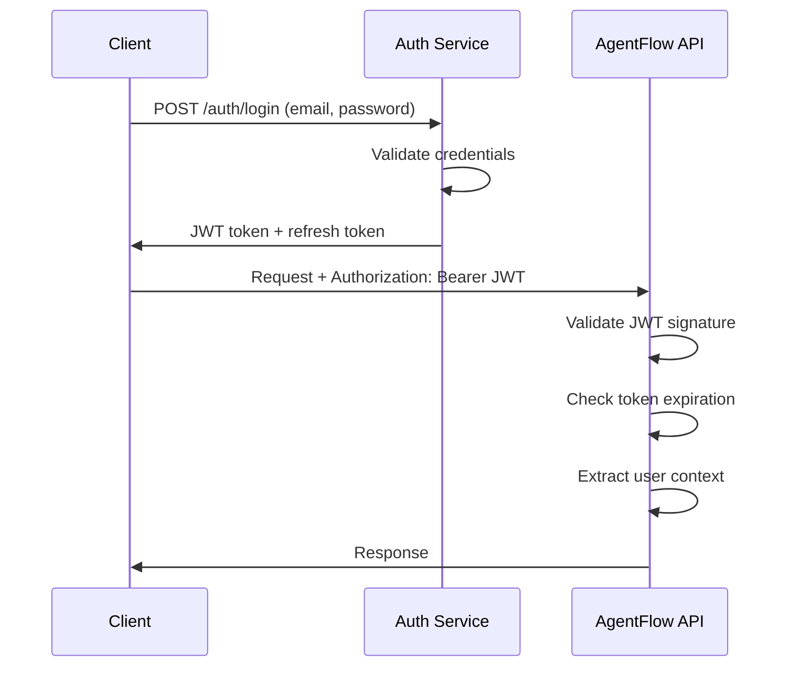

# AgentFlow Security Model

AgentFlow implements a comprehensive security-first approach designed to protect against threats specific to AI agent workloads while maintaining the flexibility needed for complex multi-agent systems.

## Security Architecture Overview

AgentFlow's security model is built on the principle of **Defense in Depth**, implementing multiple layers of protection:

```
┌─────────────────────────────────────────────────────────────┐
│                    Network Security                          │
│  TLS 1.3 • mTLS • Network Policies • DDoS Protection       │
└─────────────────────────────────────────────────────────────┘
┌─────────────────────────────────────────────────────────────┐
│                 Application Security                         │
│   JWT Auth • RBAC • Input Validation • Rate Limiting       │
└─────────────────────────────────────────────────────────────┘
┌─────────────────────────────────────────────────────────────┐
│                 Runtime Security                             │
│   WASM Sandboxing • Capability System • Resource Limits    │
└─────────────────────────────────────────────────────────────┘
┌─────────────────────────────────────────────────────────────┐
│                   Data Security                              │
│ Encryption at Rest • PII Detection • Audit Logging         │
└─────────────────────────────────────────────────────────────┘
┌─────────────────────────────────────────────────────────────┐
│               Infrastructure Security                        │
│  Container Security • Secret Management • Host Protection   │
└─────────────────────────────────────────────────────────────┘
```

## Core Security Principles

### 1. Zero Trust Architecture
- **No Implicit Trust**: Every request is authenticated and authorized
- **Micro-Segmentation**: Network isolation between components
- **Continuous Verification**: Real-time security posture assessment
- **Least Privilege**: Minimal permissions for every operation

### 2. AI-Specific Threats Protection
- **Prompt Injection Prevention**: Input sanitization and validation
- **Model Extraction Prevention**: API rate limiting and monitoring
- **Data Poisoning Protection**: Input validation and content filtering
- **Adversarial Input Detection**: Anomaly detection on agent inputs

### 3. Compliance Ready
- **SOC 2 Type II**: Security controls for service organizations
- **GDPR**: Privacy protection for EU citizens
- **HIPAA**: Healthcare data protection capabilities
- **PCI DSS**: Payment card data security standards

## Authentication and Authorization

### JWT-Based Authentication

AgentFlow uses JSON Web Tokens (JWT) with RS256 asymmetric signing for stateless authentication.

#### Token Structure
```json
{
  "header": {
    "alg": "RS256",
    "typ": "JWT",
    "kid": "agentflow-key-1"
  },
  "payload": {
    "sub": "user-123",
    "iss": "https://auth.agentflow.io",
    "aud": "https://api.agentflow.io",
    "exp": 1642262400,
    "iat": 1642176000,
    "scope": ["workflows:read", "workflows:write", "executions:read"],
    "org": "org-456",
    "role": "developer"
  }
}
```

#### Authentication Flow


### Role-Based Access Control (RBAC)

#### Built-in Roles

**System Admin**
- Full system access and configuration
- User and organization management
- System monitoring and maintenance
- Security audit and compliance

**Organization Admin**
- Organization-wide workflow management
- User invitation and role assignment
- Billing and subscription management
- Organization-level security policies

**Developer**
- Workflow creation and management
- Execution monitoring and debugging
- Access to development resources
- Limited administrative functions

**Viewer**
- Read-only access to workflows and executions
- Monitoring dashboard access
- Log viewing (non-sensitive)
- Basic reporting capabilities

**API User**
- Programmatic access via API/SDK
- Workflow execution and monitoring
- Resource usage within limits
- No UI access

#### Custom Permissions

```yaml
permissions:
  workflows:
    - create
    - read
    - update
    - delete
    - deploy
  executions:
    - create
    - read
    - stop
    - replay
  agents:
    - read
    - logs
    - debug
  metrics:
    - read
    - export
  admin:
    - users
    - billing
    - security
```

#### Permission Example
```go
type Permission struct {
    Resource string   `json:"resource"`  // "workflows", "executions"
    Actions  []string `json:"actions"`   // ["read", "write"]
    Scope    string   `json:"scope"`     // "org", "team", "self"
    Filters  []Filter `json:"filters"`   // Additional constraints
}

type Filter struct {
    Field    string      `json:"field"`     // "workflow.name"
    Operator string      `json:"operator"`  // "equals", "contains"
    Value    interface{} `json:"value"`     // "production-*"
}
```

### API Key Authentication

For programmatic access, AgentFlow supports API keys with scoped permissions.

#### API Key Structure
```
af_live_1234567890abcdef1234567890abcdef12345678  # Production
af_test_1234567890abcdef1234567890abcdef12345678  # Development
```

#### API Key Management
```bash
# Create API key
agentflow auth create-api-key \
  --name "CI/CD Pipeline" \
  --scopes "workflows:read,workflows:write,executions:read" \
  --expires "2024-12-31"

# List API keys
agentflow auth list-api-keys

# Revoke API key
agentflow auth revoke-api-key af_live_1234567890abcdef
```

## Agent Runtime Security

### WASM Sandboxing

AgentFlow runs all agent code in WebAssembly (WASM) sandboxes, providing strong isolation and security guarantees.

#### Sandbox Features

**Memory Isolation**
- Each agent gets isolated linear memory
- No direct access to host memory
- Configurable memory limits (default: 512MB)
- Automatic garbage collection

**CPU Limiting**
- Execution time limits (default: 300 seconds)
- CPU usage monitoring and throttling
- Preemptive scheduling for fairness
- Automatic termination on resource abuse

**System Call Interception**
- No direct system calls allowed
- All I/O through controlled host functions
- File system access via virtual file system
- Network access through proxy layer

#### WASM Runtime Configuration
```rust
pub struct SandboxConfig {
    pub max_memory: u64,              // 512MB default
    pub max_execution_time: Duration, // 300s default
    pub max_stack_size: u32,          // 64KB default
    pub max_fuel: u64,                // CPU instruction limit
    pub allowed_imports: Vec<String>, // Allowed host functions
    pub network_policy: NetworkPolicy,
    pub filesystem_policy: FilesystemPolicy,
}

pub struct NetworkPolicy {
    pub allowed_hosts: Vec<String>,
    pub allowed_ports: Vec<u16>,
    pub max_requests_per_minute: u32,
    pub max_request_size: u64,
    pub max_response_size: u64,
}
```

### Capability-Based Security

AgentFlow implements a capability-based security model where agents must explicitly request and be granted permissions for specific operations.

#### Core Capabilities

```rust
#[derive(Debug, Clone)]
pub enum Capability {
    // Network capabilities
    HttpRequest(HttpCapability),
    DatabaseAccess(DatabaseCapability),
    LLMAccess(LLMCapability),
    
    // File system capabilities
    FileRead(FileCapability),
    FileWrite(FileCapability),
    
    // Inter-agent communication
    MessageSend(MessageCapability),
    MessageReceive(MessageCapability),
    
    // System capabilities
    EnvironmentAccess(EnvCapability),
    TempStorage(StorageCapability),
}

#[derive(Debug, Clone)]
pub struct HttpCapability {
    pub allowed_hosts: Vec<String>,
    pub allowed_methods: Vec<HttpMethod>,
    pub max_requests_per_minute: u32,
    pub headers_whitelist: Vec<String>,
}
```

#### Capability Granting
```yaml
# In workflow definition
spec:
  agents:
    - name: data-fetcher
      capabilities:
        http:
          allowed_hosts: 
            - "api.example.com"
            - "*.trusted-domain.com"
          allowed_methods: ["GET", "POST"]
          max_requests_per_minute: 60
        file_read:
          allowed_paths: ["/tmp/input/*"]
        llm:
          providers: ["openai"]
          max_tokens_per_minute: 10000
```

### Resource Limits and Monitoring

#### Resource Constraints
```yaml
resources:
  limits:
    memory: 1Gi           # Maximum memory usage
    cpu: 500m            # Maximum CPU (0.5 cores)
    storage: 2Gi         # Temporary storage limit
    execution_time: 600s # Maximum execution time
    
  requests:
    memory: 256Mi        # Guaranteed memory
    cpu: 100m           # Guaranteed CPU
    storage: 512Mi      # Guaranteed storage
    
  policies:
    oom_kill_enabled: true     # Kill on out-of-memory
    cpu_throttle_enabled: true # Throttle on CPU limit
    network_timeout: 30s       # Network request timeout
```

#### Real-Time Monitoring
```rust
pub struct ResourceMonitor {
    memory_usage: AtomicU64,
    cpu_time_used: AtomicU64,
    network_bytes_sent: AtomicU64,
    network_bytes_received: AtomicU64,
    file_operations: AtomicU32,
    execution_start_time: Instant,
}

impl ResourceMonitor {
    pub fn check_limits(&self, limits: &ResourceLimits) -> Result<(), SecurityError> {
        if self.memory_usage.load(Ordering::Relaxed) > limits.max_memory {
            return Err(SecurityError::MemoryLimitExceeded);
        }
        
        if self.execution_start_time.elapsed() > limits.max_execution_time {
            return Err(SecurityError::TimeoutExceeded);
        }
        
        // Additional checks...
        Ok(())
    }
}
```

## Network Security

### TLS/SSL Configuration

#### Minimum TLS Version
- **TLS 1.3** for all external communications
- **TLS 1.2** minimum for legacy system compatibility
- **Perfect Forward Secrecy** (PFS) enabled
- **HTTP Strict Transport Security** (HSTS) enforced

#### Certificate Management
```yaml
# Let's Encrypt integration
apiVersion: cert-manager.io/v1
kind: Certificate
metadata:
  name: agentflow-tls
  namespace: agentflow
spec:
  secretName: agentflow-tls
  issuerRef:
    name: letsencrypt-prod
    kind: ClusterIssuer
  dnsNames:
  - api.agentflow.io
  - dashboard.agentflow.io
```

### Mutual TLS (mTLS)

For service-to-service communication, AgentFlow uses mutual TLS authentication.

#### mTLS Configuration
```yaml
# Istio service mesh configuration
apiVersion: security.istio.io/v1beta1
kind: PeerAuthentication
metadata:
  name: default
  namespace: agentflow
spec:
  mtls:
    mode: STRICT

---
apiVersion: security.istio.io/v1beta1
kind: AuthorizationPolicy
metadata:
  name: agentflow-authz
  namespace: agentflow
spec:
  rules:
  - from:
    - source:
        principals: ["cluster.local/ns/agentflow/sa/orchestrator"]
    to:
    - operation:
        methods: ["GET", "POST"]
```

### Network Policies

#### Ingress Control
```yaml
apiVersion: networking.k8s.io/v1
kind: NetworkPolicy
metadata:
  name: orchestrator-ingress
  namespace: agentflow
spec:
  podSelector:
    matchLabels:
      app: orchestrator
  policyTypes:
  - Ingress
  - Egress
  ingress:
  - from:
    - namespaceSelector:
        matchLabels:
          name: ingress-nginx
    ports:
    - protocol: TCP
      port: 8080
  - from:
    - podSelector:
        matchLabels:
          app: runtime
    ports:
    - protocol: TCP
      port: 8080
```

#### Egress Control
```yaml
# Restrict external access
egress:
- to: []
  ports:
  - protocol: TCP
    port: 5432  # PostgreSQL
  - protocol: TCP
    port: 6379  # Redis
  - protocol: TCP
    port: 4222  # NATS
- to:
  - namespaceSelector:
      matchLabels:
        name: kube-system
  ports:
  - protocol: TCP
    port: 53   # DNS
  - protocol: UDP
    port: 53   # DNS
- to: []
  ports:
  - protocol: TCP
    port: 443  # HTTPS for LLM APIs
```

### DDoS Protection

#### Rate Limiting
```yaml
# Nginx ingress rate limiting
apiVersion: networking.k8s.io/v1
kind: Ingress
metadata:
  name: agentflow-ingress
  annotations:
    nginx.ingress.kubernetes.io/rate-limit: "100"
    nginx.ingress.kubernetes.io/rate-limit-window: "1m"
    nginx.ingress.kubernetes.io/rate-limit-connections: "10"
```

#### Application-Level Rate Limiting
```go
type RateLimiter struct {
    redis    *redis.Client
    limits   map[string]RateLimit
    counters sync.Map
}

type RateLimit struct {
    Requests   int           `json:"requests"`
    Window     time.Duration `json:"window"`
    BurstSize  int           `json:"burst_size"`
}

func (rl *RateLimiter) Allow(key string, limitType string) (bool, error) {
    limit, exists := rl.limits[limitType]
    if !exists {
        return true, nil
    }
    
    current, err := rl.redis.Incr(key).Result()
    if err != nil {
        return false, err
    }
    
    if current == 1 {
        rl.redis.Expire(key, limit.Window)
    }
    
    return current <= int64(limit.Requests), nil
}
```

## Data Security

### Encryption

#### Encryption at Rest
- **Database**: AES-256 encryption for all stored data
- **File Storage**: AES-256 encryption for temporary files
- **Secrets**: HashiCorp Vault or Kubernetes secrets with encryption
- **Backups**: Encrypted backup storage with separate key management

#### Encryption in Transit
- **API Communications**: TLS 1.3 with perfect forward secrecy
- **Internal Services**: mTLS for all service-to-service communication
- **Database Connections**: SSL/TLS encrypted database connections
- **Message Queue**: TLS encryption for NATS messaging

#### Key Management
```yaml
# HashiCorp Vault integration
apiVersion: v1
kind: Secret
metadata:
  name: vault-auth
  namespace: agentflow
type: Opaque
data:
  role-id: <base64-encoded-role-id>
  secret-id: <base64-encoded-secret-id>

---
apiVersion: v1
kind: ConfigMap
metadata:
  name: vault-config
data:
  vault-addr: "https://vault.agentflow.io"
  vault-path: "agentflow/data"
```

### Data Classification and Handling

#### Automatic PII Detection
```go
type PIIDetector struct {
    patterns map[string]*regexp.Regexp
    ml_model *PIIClassifier
}

func (d *PIIDetector) ScanContent(content string) (*PIIReport, error) {
    report := &PIIReport{
        HasPII:     false,
        Categories: []string{},
        Locations:  []PIILocation{},
    }
    
    // Pattern-based detection
    for category, pattern := range d.patterns {
        matches := pattern.FindAllStringSubmatch(content, -1)
        for _, match := range matches {
            report.HasPII = true
            report.Categories = append(report.Categories, category)
            report.Locations = append(report.Locations, PIILocation{
                Category: category,
                Start:    strings.Index(content, match[0]),
                End:      strings.Index(content, match[0]) + len(match[0]),
                Value:    match[0],
            })
        }
    }
    
    // ML-based detection
    mlResults, err := d.ml_model.Classify(content)
    if err == nil {
        // Process ML results...
    }
    
    return report, nil
}
```

#### Data Retention Policies
```yaml
data_retention:
  workflow_definitions: 7_years
  execution_logs: 90_days
  debug_information: 30_days
  audit_logs: 5_years
  pii_data: 30_days  # Or user-defined retention
  
automatic_deletion:
  enabled: true
  schedule: "0 2 * * *"  # Daily at 2 AM
  batch_size: 1000
```

### Data Privacy Controls

#### GDPR Compliance
```go
type GDPRController struct {
    db        *sql.DB
    analytics *ClickHouse
    logs      *LogStore
}

func (g *GDPRController) ProcessDataSubjectRequest(req *DataSubjectRequest) error {
    switch req.Type {
    case "access":
        return g.exportUserData(req.UserID)
    case "deletion":
        return g.deleteUserData(req.UserID)
    case "rectification":
        return g.updateUserData(req.UserID, req.Updates)
    case "portability":
        return g.exportPortableData(req.UserID)
    }
    return nil
}

func (g *GDPRController) deleteUserData(userID string) error {
    // Delete from primary database
    _, err := g.db.Exec("DELETE FROM user_data WHERE user_id = ?", userID)
    if err != nil {
        return err
    }
    
    // Delete from analytics
    err = g.analytics.DeleteUserData(userID)
    if err != nil {
        return err
    }
    
    // Delete from logs (anonymize)
    return g.logs.AnonymizeUserLogs(userID)
}
```

## Audit Logging and Compliance

### Comprehensive Audit Trail

AgentFlow maintains detailed audit logs for all security-relevant events.

#### Audit Event Types
```go
type AuditEvent struct {
    ID          string                 `json:"id"`
    Timestamp   time.Time              `json:"timestamp"`
    UserID      string                 `json:"user_id"`
    Action      string                 `json:"action"`
    Resource    string                 `json:"resource"`
    ResourceID  string                 `json:"resource_id"`
    Source      AuditSource            `json:"source"`
    Result      AuditResult            `json:"result"`
    Metadata    map[string]interface{} `json:"metadata"`
    IPAddress   string                 `json:"ip_address"`
    UserAgent   string                 `json:"user_agent"`
    SessionID   string                 `json:"session_id"`
}

const (
    // Authentication events
    AuditLogin           = "auth.login"
    AuditLogout          = "auth.logout"
    AuditTokenGenerate   = "auth.token.generate"
    AuditTokenRevoke     = "auth.token.revoke"
    
    // Authorization events
    AuditPermissionGrant = "authz.permission.grant"
    AuditPermissionDeny  = "authz.permission.deny"
    AuditRoleAssign      = "authz.role.assign"
    
    // Resource events
    AuditWorkflowCreate  = "workflow.create"
    AuditWorkflowUpdate  = "workflow.update"
    AuditWorkflowDelete  = "workflow.delete"
    AuditExecutionStart  = "execution.start"
    AuditExecutionStop   = "execution.stop"
    
    // Security events
    AuditSecurityViolation = "security.violation"
    AuditSuspiciousActivity = "security.suspicious"
    AuditDataAccess        = "data.access"
    AuditDataModification  = "data.modification"
)
```

#### Audit Log Storage
```yaml
# ClickHouse audit table
CREATE TABLE audit_logs (
    id String,
    timestamp DateTime64(3),
    user_id String,
    action String,
    resource String,
    resource_id String,
    source_ip String,
    user_agent String,
    session_id String,
    result Enum8('success' = 1, 'failure' = 2, 'error' = 3),
    metadata String,  -- JSON
    INDEX idx_timestamp timestamp TYPE minmax GRANULARITY 1,
    INDEX idx_user_id user_id TYPE bloom_filter GRANULARITY 1,
    INDEX idx_action action TYPE bloom_filter GRANULARITY 1
) ENGINE = MergeTree()
ORDER BY (timestamp, user_id, action)
PARTITION BY toYYYYMM(timestamp)
TTL timestamp + INTERVAL 5 YEAR;
```

### Compliance Reporting

#### SOC 2 Controls
```go
type SOC2Report struct {
    Period     DateRange              `json:"period"`
    Controls   []ControlAssessment    `json:"controls"`
    Exceptions []ControlException     `json:"exceptions"`
    Evidence   []EvidenceItem        `json:"evidence"`
}

type ControlAssessment struct {
    ControlID    string  `json:"control_id"`
    Description  string  `json:"description"`
    Status       string  `json:"status"`  // "effective", "deficient"
    TestResults  []Test  `json:"test_results"`
}

func (r *ComplianceReporter) GenerateSOC2Report(period DateRange) (*SOC2Report, error) {
    report := &SOC2Report{Period: period}
    
    // CC6.1 - Logical and physical access controls
    accessControl := r.assessAccessControls(period)
    report.Controls = append(report.Controls, accessControl)
    
    // CC6.7 - Data transmission and disposal
    dataProtection := r.assessDataProtection(period)
    report.Controls = append(report.Controls, dataProtection)
    
    // CC7.1 - System monitoring
    monitoring := r.assessMonitoring(period)
    report.Controls = append(report.Controls, monitoring)
    
    return report, nil
}
```

## Incident Response

### Security Incident Detection

#### Automated Threat Detection
```go
type ThreatDetector struct {
    rules       []DetectionRule
    ml_engine   *AnomalyDetector
    alert_mgr   *AlertManager
}

type DetectionRule struct {
    ID          string                 `json:"id"`
    Name        string                 `json:"name"`
    Description string                 `json:"description"`
    Query       string                 `json:"query"`
    Threshold   float64               `json:"threshold"`
    Severity    string                `json:"severity"`
    Actions     []ResponseAction       `json:"actions"`
}

// Example detection rules
var DefaultRules = []DetectionRule{
    {
        ID:   "auth-bruteforce",
        Name: "Authentication Brute Force",
        Query: `
            SELECT user_id, COUNT(*) as failed_attempts
            FROM audit_logs 
            WHERE action = 'auth.login' 
              AND result = 'failure'
              AND timestamp > now() - INTERVAL 5 MINUTE
            GROUP BY user_id
            HAVING failed_attempts > 5
        `,
        Threshold: 5,
        Severity:  "high",
        Actions: []ResponseAction{
            {Type: "block_user", Duration: "1h"},
            {Type: "alert", Channels: ["security-team"]},
        },
    },
    {
        ID:   "suspicious-workflow",
        Name: "Suspicious Workflow Activity",
        Query: `
            SELECT workflow_id, COUNT(*) as execution_count,
                   AVG(resource_usage) as avg_resources
            FROM executions
            WHERE created_at > now() - INTERVAL 10 MINUTE
            GROUP BY workflow_id
            HAVING execution_count > 100 OR avg_resources > 2.0
        `,
        Threshold: 100,
        Severity:  "medium",
        Actions: []ResponseAction{
            {Type: "throttle_workflow", Rate: "10/minute"},
            {Type: "alert", Channels: ["ops-team"]},
        },
    },
}
```

### Incident Response Playbook

#### Severity Levels

**Critical (P0)**
- Data breach or suspected breach
- Complete system compromise
- Widespread service outage
- **Response Time**: 15 minutes
- **Escalation**: Immediate executive notification

**High (P1)**  
- Individual account compromise
- Security control failure
- Partial service outage
- **Response Time**: 1 hour
- **Escalation**: Security team lead

**Medium (P2)**
- Suspicious activity detection
- Performance degradation
- Configuration drift
- **Response Time**: 4 hours
- **Escalation**: On-call engineer

**Low (P3)**
- Policy violations
- Compliance gaps
- Minor security events
- **Response Time**: 24 hours
- **Escalation**: Next business day

#### Response Procedures

**Phase 1: Detection and Analysis**
1. Alert validation and initial assessment
2. Incident classification and severity assignment
3. Evidence collection and preservation
4. Initial containment actions

**Phase 2: Containment**
1. Isolate affected systems
2. Prevent spread of compromise
3. Preserve evidence for investigation
4. Implement temporary workarounds

**Phase 3: Eradication and Recovery**
1. Remove threat from environment
2. Patch vulnerabilities
3. Restore services from clean backups
4. Implement additional security controls

**Phase 4: Post-Incident Activities**
1. Conduct post-mortem analysis
2. Update security controls and procedures
3. Provide incident report to stakeholders
4. Implement lessons learned

### Forensics and Evidence Collection

#### Digital Forensics Toolkit
```bash
#!/bin/bash
# incident-response.sh

INCIDENT_ID=$1
TIMESTAMP=$(date +%Y%m%d_%H%M%S)
EVIDENCE_DIR="/forensics/${INCIDENT_ID}_${TIMESTAMP}"

mkdir -p $EVIDENCE_DIR

# Collect system state
kubectl get all -A > $EVIDENCE_DIR/kubernetes_state.txt
kubectl describe nodes > $EVIDENCE_DIR/node_details.txt
kubectl get events --sort-by=.metadata.creationTimestamp > $EVIDENCE_DIR/kubernetes_events.txt

# Collect logs
kubectl logs -l app=orchestrator --since=24h > $EVIDENCE_DIR/orchestrator_logs.txt
kubectl logs -l app=runtime --since=24h > $EVIDENCE_DIR/runtime_logs.txt

# Collect audit logs
clickhouse-client --query "
    SELECT * FROM audit_logs 
    WHERE timestamp > now() - INTERVAL 24 HOUR
    FORMAT CSV
" > $EVIDENCE_DIR/audit_logs.csv

# Collect metrics
curl -s "http://prometheus:9090/api/v1/query_range?query=up&start=$(date -d '24 hours ago' +%s)&end=$(date +%s)&step=60" > $EVIDENCE_DIR/metrics.json

# Create evidence package
tar -czf "${EVIDENCE_DIR}.tar.gz" $EVIDENCE_DIR
sha256sum "${EVIDENCE_DIR}.tar.gz" > "${EVIDENCE_DIR}.tar.gz.sha256"

echo "Evidence collected in ${EVIDENCE_DIR}.tar.gz"
```

## Security Best Practices

### Development Security

#### Secure Coding Guidelines
1. **Input Validation**: Validate all user inputs and API parameters
2. **Output Encoding**: Properly encode outputs to prevent injection attacks
3. **Error Handling**: Don't expose sensitive information in error messages
4. **Authentication**: Implement proper session management
5. **Authorization**: Check permissions for every operation
6. **Cryptography**: Use well-established cryptographic libraries
7. **Logging**: Log security events without exposing sensitive data

#### Security Testing
```yaml
# Security testing pipeline
security_checks:
  static_analysis:
    - tool: "gosec"
      config: ".gosec.json"
    - tool: "semgrep"
      rules: "security"
      
  dependency_scanning:
    - tool: "snyk"
      fail_on: "high"
    - tool: "npm audit"
      
  container_scanning:
    - tool: "trivy"
      severity: "HIGH,CRITICAL"
    - tool: "clair"
      
  dynamic_testing:
    - tool: "zap"
      target: "https://api-dev.agentflow.io"
    - tool: "nuclei"
      templates: "web"
```

### Operational Security

#### Security Monitoring
```yaml
# Prometheus security alerts
groups:
- name: security.rules
  rules:
  - alert: HighFailedLoginRate
    expr: rate(agentflow_auth_failures_total[5m]) > 0.1
    for: 2m
    labels:
      severity: warning
    annotations:
      summary: "High authentication failure rate detected"
      
  - alert: SuspiciousResourceUsage
    expr: avg_over_time(agentflow_agent_memory_usage[10m]) > 0.9
    for: 5m
    labels:
      severity: critical
    annotations:
      summary: "Agent consuming excessive resources"
      
  - alert: UnauthorizedAPIAccess
    expr: rate(agentflow_api_unauthorized_total[5m]) > 0.05
    for: 1m
    labels:
      severity: high
    annotations:
      summary: "Unusual unauthorized API access pattern"
```

#### Regular Security Tasks

**Daily**
- Review security alerts and incidents
- Monitor authentication patterns
- Check for failed login attempts
- Verify backup integrity

**Weekly**
- Review access permissions and user accounts
- Update security patches
- Analyze security metrics and trends
- Test incident response procedures

**Monthly**
- Conduct security assessments
- Review and update security policies
- Perform penetration testing
- Update threat intelligence

**Quarterly**
- Security architecture review
- Compliance audit preparation
- Security training updates
- Business continuity testing

This comprehensive security model ensures that AgentFlow provides enterprise-grade protection while maintaining the flexibility needed for AI agent workloads.